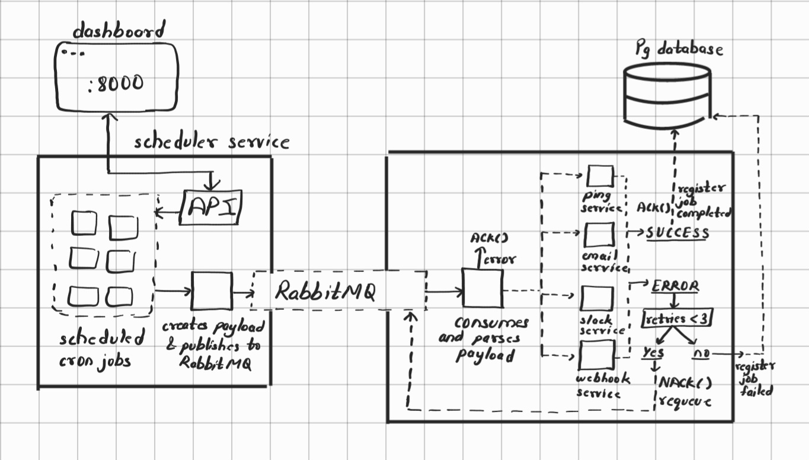
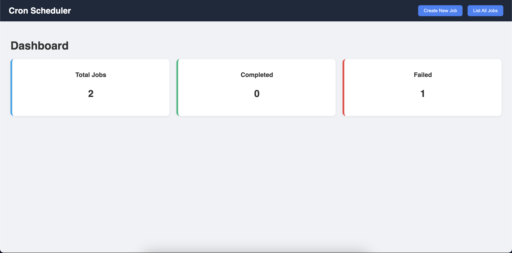
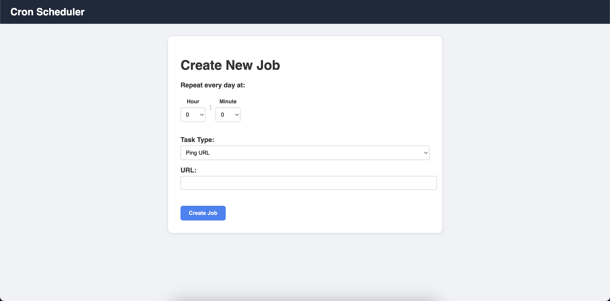
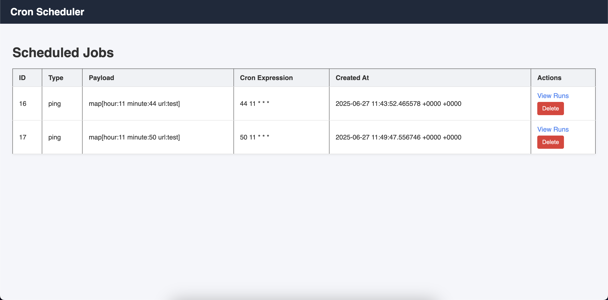
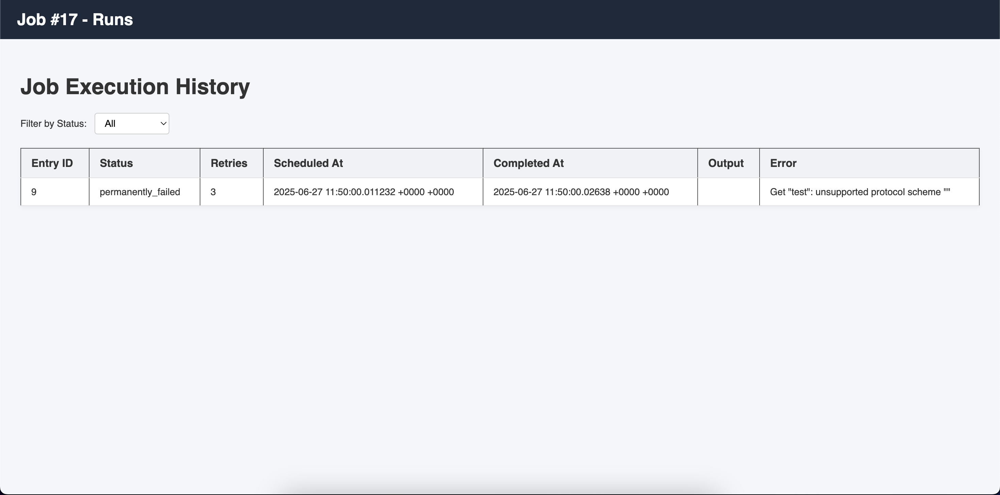

# Cronflow

This project is about a cron scheduler service which schedules cron jobs via scheduler service which are created using a dashboard interface. It publishes the jobs to the consumer service through RabbitMQ job queue, where it acknowledges successful job execution and retries for upto 3 times on job failures. And thus updates the job status in PostgreSQL database for tracking through the dashboard interface.

## Architecture overview



## Dashboard

1. Home page

   Shows total no. of jobs scheduled, completed job entries and failed job entries.
   

2. Create new job

   Lets users create new jobs
   

3. List all jobs

   List all of the scheduled jobs that displays type, job payload, the cron expr and created time.
   

4. List job entries

   List job run entries and shows the execution status, retry count, scheduled time, completed time, success output message and error message.
   

## Detailed flow

### Creating a new job

1. User has to select the `hour` and `minutes` they want the task to repeat everyday.
2. They select a `task` from the given dropdown options:
   - Ping a URL (requires a GET url)
   - Send an email (requires receiver email, subject & body)
   - Send a slack message (requires the slack's webhook url and the text message)
   - Trigger a webhook (requires the webhook's POST url and the json body)
3. On clicking `submit` button, an internal POST `/api/create` API will be called to schedule the job.

### Scheduling & Publishing the job

1. A job will be created and registered into the PostgreSQL database.
2. Using `robfig/cron` package, a cron job will be scheduled to repeat everyday on the given `hour` and `minutes` time.
3. On the scheduled time, the service will publish the job with it's details as payload to RabbitMQ queue.

### Consuming & Processing jobs

1. A consumer service is actively waiting for jobs over the RabbitMQ's queue channel.
2. When a job is received, we first check for any errors in parsing the required details from payload. On errors, the job is acknowledged(to not requeue them) as we can't even mark them as failed in DB without proper job details.
3. On proper payload parsing, we first check if this job run was already tried on that scheduled time and whether it is a retry. If not, we register a new job entry in DB.
4. If it is a retry, we check if the retries has exceed maximum retries(3), if yes - then we mark the job as permanently_failed in DB and ACK() the job(to not requeue). If it is new job run or retries is less than 3, then we process the job based on it's type(ping, email, slack, webhook).
5. If job execution is failed, we mark job as failed and update the job run details in DB with updated retry count and error message. We NACK() the job to requeue it again with a time offset of 2 seconds.
6. If job execution is success, we update the job run as completed with the output message in DB and ACK() the job.

## Run with Docker Compose

For this project, a PostgreSQL database and RabbitMQ is required.

For sending email, we use SMTP server from `mailtrap.io`. Place mailtrap's key pass in env file.

In the `.env` file, place the credentials:

```env
DASHBOARD_PORT=8000

PG_HOST=host.docker.internal
PG_PORT=5432
PG_USER=postgres
PG_PASSWORD=postgres
PG_DBNAME=postgres

RMQ_USER=admin
RMQ_PASSWORD=admin
RMQ_HOST=host.docker.internal
RMQ_PORT=5672
RMQ_VHOST=/

MAIL_PASS=*******************
```

Build and Run with docker-compose:

```bash
docker-compose --env-file .env -p cronflow up -d --build
```

## Note

When deployed on docker, it will use UTC timezone for scheduling cron jobs.

## Blog

You can read this blog: [Building a Cron Scheduler with RabbitMQ in Go](https://blog.anikety.com/building-a-cron-scheduler-with-rabbitmq-in-go), to understand the code about scheduling cron jobs, publishing the jobs over RabbitMQ queue, consuming the job from queue, processing the job and acknowledging & retrying on failures.

## Future/TODO

- Using dead letter queues (DLQ) for futher processing/analytics of the permanently failed jobs
- Using Redis locks to ensure single execution, in case multiple consumers are listening over the queue or the same job was re-published.
